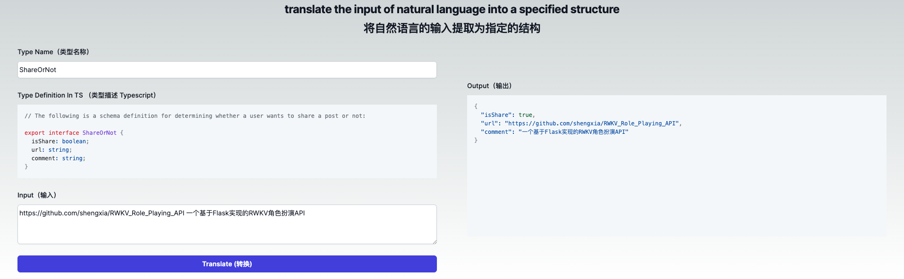

<h1 align="center">Json Translator</h1>
Translate the input of natural language into a specified structure.



- powered by [microsoft/TypeChat](https://github.com/microsoft/TypeChat)

## Online Demo
https://nts.cooder.org/

## Getting Started

First, copy `.env.template` to `.env.local`, and set your environment variable(OpenAI API key、google sheets key...) in `.env.local`:

```bash
cp .env.template .env.local
```

Then, run the development server:

```bash
npm run dev
# or
yarn dev
# or
pnpm dev
```

Open [http://localhost:3000](http://localhost:3000) with your browser to see the result.

## Deploy on Vercel

[](https://vercel.com/new/clone?repository-url=https%3A%2F%2Fgithub.com%2Fcooder-org%2Fjson-translator&env=OPENAI_API_KEY&project-name=json-translator&repository-name=json-translator)


## API ENDPOINT

 - /api/translate

```bash
curl -X 'POST' \
  'http://127.0.0.1:3000/api/translate' \
  -H 'accept: */*' \
  -H 'Content-Type: application/json' \
  -d '{
  "schema": "// The following is a schema definition for determining whether a user wants to share a post or not:\nexport interface ShareOrNot {\nisShare: boolean;\nurl: string;\ncomment: string;\n}",
  "typeName": "ShareOrNot",
  "prompt": "https://github.com/shengxia/RWKV_Role_Playing_API 一个基于Flask实现的RWKV角色扮演API"
}'

```